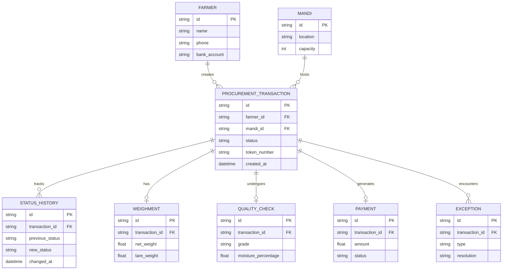

# Database Schema

## Entity Relationship Diagram

```mermaid
erDiagram
    FARMER {
        string id PK
        string name
        string phone
        string bank_account
    }
    MANDI {
        string id PK
        string location
        int capacity
    }
    PROCUREMENT_TRANSACTION {
        string id PK
        string farmer_id FK
        string mandi_id FK
        string status
        string token_number
        datetime created_at
    }
    STATUS_HISTORY {
        string id PK
        string transaction_id FK
        string previous_status
        string new_status
        datetime changed_at
    }
    WEIGHMENT {
        string id PK
        string transaction_id FK
        float net_weight
        float tare_weight
    }
    QUALITY_CHECK {
        string id PK
        string transaction_id FK
        string grade
        float moisture_percentage
    }
    PAYMENT {
        string id PK
        string transaction_id FK
        float amount
        string status
    }
    EXCEPTION {
        string id PK
        string transaction_id FK
        string type
        string resolution
    }

    FARMER ||--o{ PROCUREMENT_TRANSACTION : creates
    MANDI ||--o{ PROCUREMENT_TRANSACTION : hosts
    PROCUREMENT_TRANSACTION ||--o{ STATUS_HISTORY : tracks
    PROCUREMENT_TRANSACTION ||--o| WEIGHMENT : has
    PROCUREMENT_TRANSACTION ||--o| QUALITY_CHECK : undergoes
    PROCUREMENT_TRANSACTION ||--o| PAYMENT : generates
    PROCUREMENT_TRANSACTION ||--o{ EXCEPTION : encounters
```

## Relational Schema
All tables will follow third normal form (3NF). Primary keys are UUIDs. Foreign keys enforce referential integrity.
