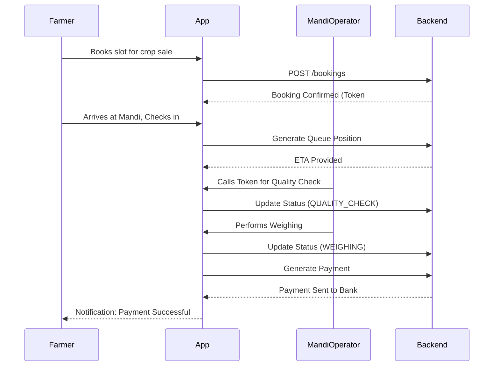

# User Flows

## 1. Ramesh Nayak Hero Journey (Sequence Diagram)

## 2. Exception Resolution Flow
1. **Detection**: Operator flags an issue (e.g., high moisture in crop).
2. **Hold State**: Transaction moves to an exception state.
3. **Admin Review**: Admin reviews the dispute via dashboard.
4. **Resolution**: Admin either rejects the crop or approves with a penalty.
5. **Resume**: Transaction resumes or is marked as rejected.
